# Freelancing Project - Complete System Documentation

## Project Overview

A full-stack freelancing platform connecting clients with freelancers. Clients can post projects, and freelancers can submit proposals.

---

## 1. Entity Relationship (ER) Diagram

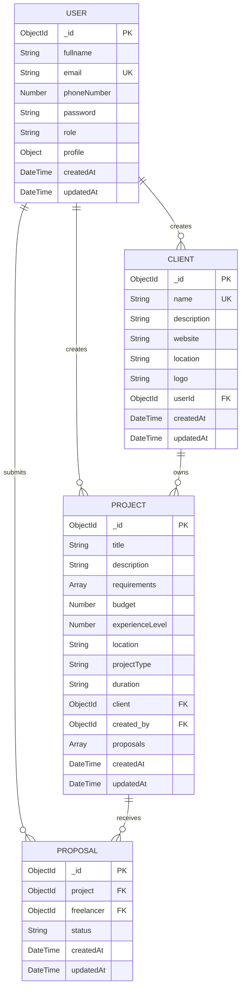

---

## 2. Class Diagram

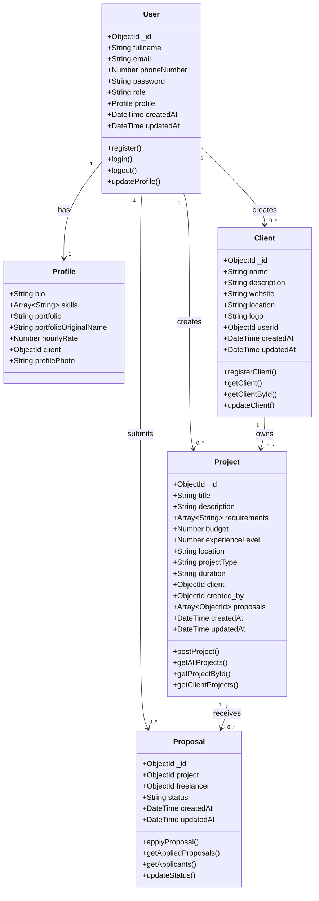

---

## 3. Data Flow Diagram (DFD)

### Level 0 - Context Diagram

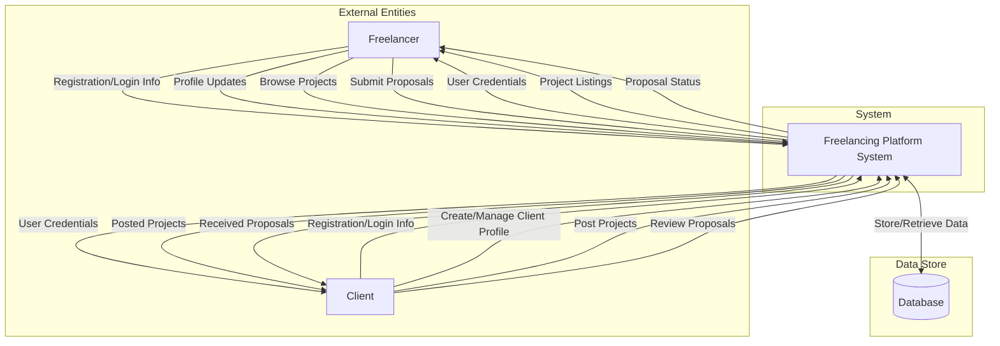

### Level 1 - Major Processes

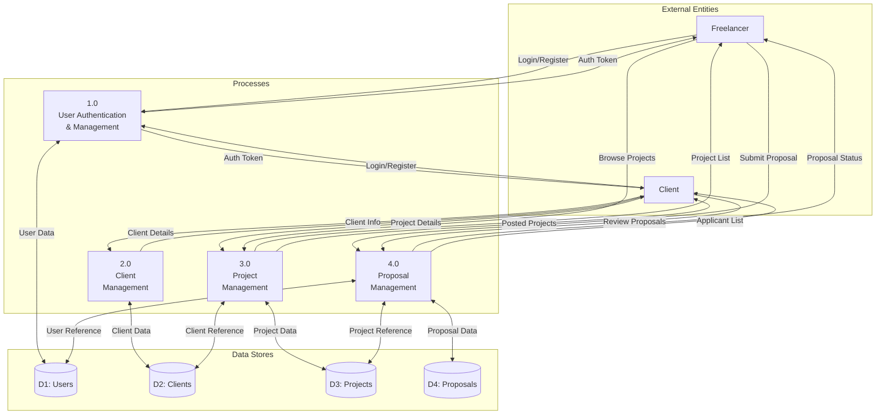

### Level 2 - Detailed User Authentication & Management

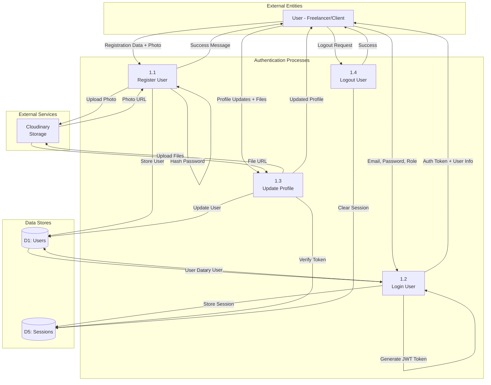

### Level 2 - Detailed Project Management

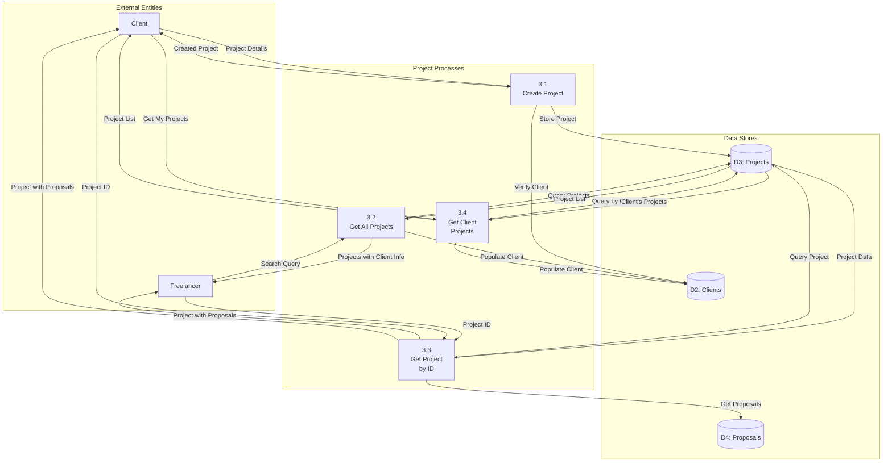

### Level 2 - Detailed Proposal Management

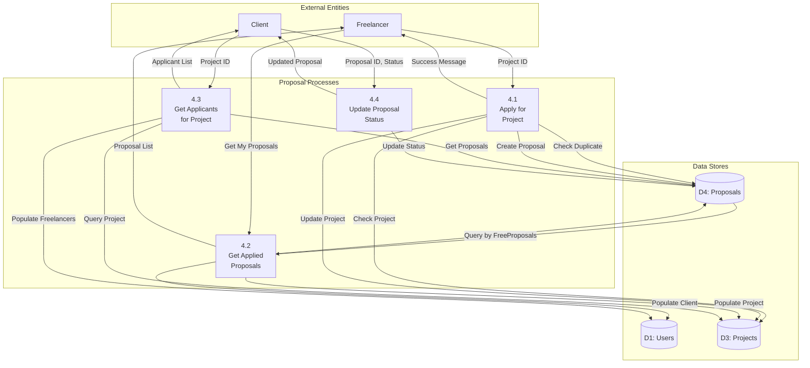

---

## 4. Activity Diagrams

### User Registration Activity Diagram

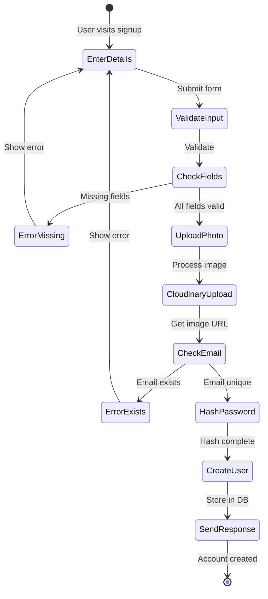

### User Login Activity Diagram

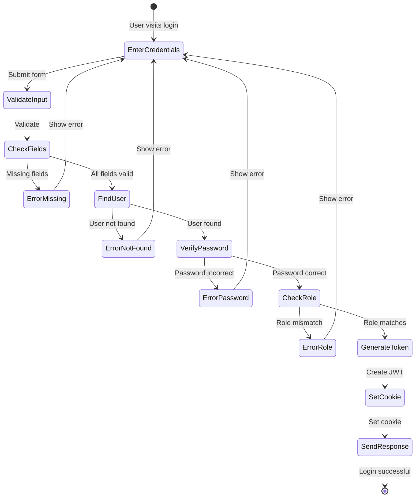

### Project Posting Activity Diagram

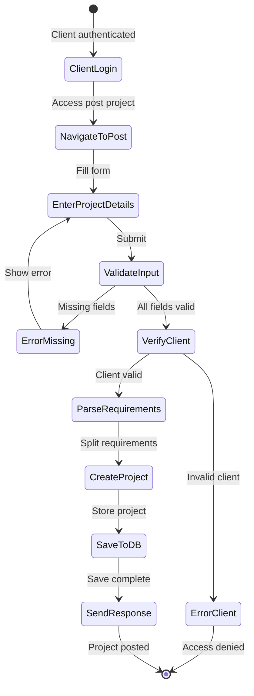

### Proposal Submission Activity Diagram

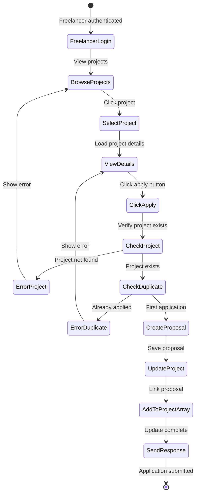

### Proposal Review Activity Diagram

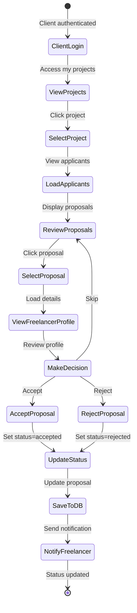

---

## 5. Database Tables Structure

### Table: users

| Field Name                    | Data Type     | Constraints                            | Description                 |
| ----------------------------- | ------------- | -------------------------------------- | --------------------------- |
| \_id                          | ObjectId      | PRIMARY KEY, AUTO                      | Unique user identifier      |
| fullname                      | String        | NOT NULL                               | Full name of user           |
| email                         | String        | NOT NULL, UNIQUE                       | Email address               |
| phoneNumber                   | Number        | NOT NULL                               | Contact number              |
| password                      | String        | NOT NULL                               | Hashed password             |
| role                          | String        | NOT NULL, ENUM('freelancer', 'client') | User role                   |
| profile.bio                   | String        | NULLABLE                               | User biography              |
| profile.skills                | Array[String] | NULLABLE                               | List of skills              |
| profile.portfolio             | String        | NULLABLE                               | Portfolio file URL          |
| profile.portfolioOriginalName | String        | NULLABLE                               | Original file name          |
| profile.hourlyRate            | Number        | NULLABLE                               | Hourly rate for freelancers |
| profile.client                | ObjectId      | NULLABLE, FK(clients.\_id)             | Reference to client profile |
| profile.profilePhoto          | String        | DEFAULT ''                             | Profile photo URL           |
| createdAt                     | DateTime      | AUTO                                   | Creation timestamp          |
| updatedAt                     | DateTime      | AUTO                                   | Last update timestamp       |

**Indexes:**

- PRIMARY: `_id`
- UNIQUE: `email`

---

### Table: clients

| Field Name  | Data Type | Constraints              | Description              |
| ----------- | --------- | ------------------------ | ------------------------ |
| \_id        | ObjectId  | PRIMARY KEY, AUTO        | Unique client identifier |
| name        | String    | NOT NULL, UNIQUE         | Client/Company name      |
| description | String    | NULLABLE                 | Client description       |
| website     | String    | NULLABLE                 | Company website URL      |
| location    | String    | NULLABLE                 | Client location          |
| logo        | String    | NULLABLE                 | Company logo URL         |
| userId      | ObjectId  | NOT NULL, FK(users.\_id) | Reference to user        |
| createdAt   | DateTime  | AUTO                     | Creation timestamp       |
| updatedAt   | DateTime  | AUTO                     | Last update timestamp    |

**Indexes:**

- PRIMARY: `_id`
- UNIQUE: `name`
- FOREIGN KEY: `userId` REFERENCES `users(_id)`

---

### Table: projects

| Field Name      | Data Type       | Constraints                  | Description               |
| --------------- | --------------- | ---------------------------- | ------------------------- |
| \_id            | ObjectId        | PRIMARY KEY, AUTO            | Unique project identifier |
| title           | String          | NOT NULL                     | Project title             |
| description     | String          | NOT NULL                     | Project description       |
| requirements    | Array[String]   | NULLABLE                     | List of requirements      |
| budget          | Number          | NOT NULL                     | Project budget            |
| experienceLevel | Number          | NOT NULL                     | Required experience level |
| location        | String          | NOT NULL                     | Project location          |
| projectType     | String          | NOT NULL                     | Type of project           |
| duration        | String          | NOT NULL                     | Project duration          |
| client          | ObjectId        | NOT NULL, FK(clients.\_id)   | Reference to client       |
| created_by      | ObjectId        | NOT NULL, FK(users.\_id)     | Reference to creator      |
| proposals       | Array[ObjectId] | NULLABLE, FK(proposals.\_id) | List of proposals         |
| createdAt       | DateTime        | AUTO                         | Creation timestamp        |
| updatedAt       | DateTime        | AUTO                         | Last update timestamp     |

**Indexes:**

- PRIMARY: `_id`
- FOREIGN KEY: `client` REFERENCES `clients(_id)`
- FOREIGN KEY: `created_by` REFERENCES `users(_id)`
- INDEX: `title`, `description` (for search)

---

### Table: proposals

| Field Name | Data Type | Constraints                                                | Description                |
| ---------- | --------- | ---------------------------------------------------------- | -------------------------- |
| \_id       | ObjectId  | PRIMARY KEY, AUTO                                          | Unique proposal identifier |
| project    | ObjectId  | NOT NULL, FK(projects.\_id)                                | Reference to project       |
| freelancer | ObjectId  | NOT NULL, FK(users.\_id)                                   | Reference to freelancer    |
| status     | String    | DEFAULT 'pending', ENUM('pending', 'accepted', 'rejected') | Proposal status            |
| createdAt  | DateTime  | AUTO                                                       | Creation timestamp         |
| updatedAt  | DateTime  | AUTO                                                       | Last update timestamp      |

**Indexes:**

- PRIMARY: `_id`
- FOREIGN KEY: `project` REFERENCES `projects(_id)`
- FOREIGN KEY: `freelancer` REFERENCES `users(_id)`
- COMPOSITE INDEX: `(project, freelancer)` (for duplicate check)

---

## 6. System Architecture Snapshot

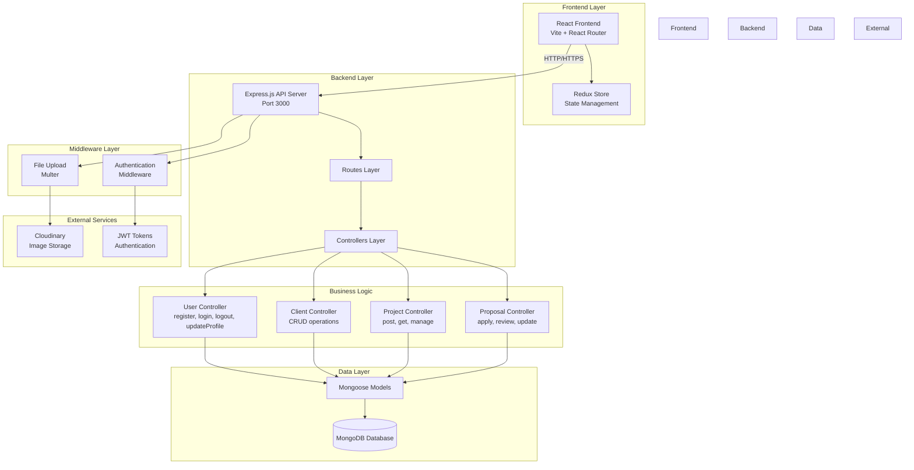

---

## 7. API Endpoints Documentation

### User Routes (`/api/v1/user`)

| Method | Endpoint          | Description         | Auth Required |
| ------ | ----------------- | ------------------- | ------------- |
| POST   | `/register`       | Register new user   | No            |
| POST   | `/login`          | User login          | No            |
| GET    | `/logout`         | User logout         | Yes           |
| POST   | `/profile/update` | Update user profile | Yes           |

### Client Routes (`/api/v1/client`)

| Method | Endpoint      | Description         | Auth Required |
| ------ | ------------- | ------------------- | ------------- |
| POST   | `/register`   | Register new client | Yes           |
| GET    | `/get`        | Get all clients     | Yes           |
| GET    | `/get/:id`    | Get client by ID    | Yes           |
| PUT    | `/update/:id` | Update client       | Yes           |

### Project Routes (`/api/v1/project`)

| Method | Endpoint             | Description           | Auth Required |
| ------ | -------------------- | --------------------- | ------------- |
| POST   | `/post`              | Post new project      | Yes (Client)  |
| GET    | `/get`               | Get all projects      | Yes           |
| GET    | `/get/:id`           | Get project by ID     | Yes           |
| GET    | `/getclientprojects` | Get client's projects | Yes (Client)  |

### Proposal Routes (`/api/v1/proposal`)

| Method | Endpoint             | Description            | Auth Required    |
| ------ | -------------------- | ---------------------- | ---------------- |
| GET    | `/apply/:id`         | Apply for project      | Yes (Freelancer) |
| GET    | `/get`               | Get applied proposals  | Yes (Freelancer) |
| GET    | `/:id/applicants`    | Get project applicants | Yes (Client)     |
| POST   | `/status/:id/update` | Update proposal status | Yes (Client)     |

---

## 8. Technology Stack

### Frontend

- **Framework**: React 18
- **Build Tool**: Vite
- **Routing**: React Router DOM
- **State Management**: Redux Toolkit + Redux Persist
- **Styling**: Tailwind CSS
- **UI Components**: Custom components + shadcn/ui
- **HTTP Client**: Axios (implied)

### Backend

- **Runtime**: Node.js
- **Framework**: Express.js
- **Database**: MongoDB with Mongoose ODM
- **Authentication**: JWT (jsonwebtoken) + bcryptjs
- **File Upload**: Multer
- **Cloud Storage**: Cloudinary
- **CORS**: cors middleware
- **Cookie Parser**: cookie-parser

### Development Tools

- **Package Manager**: npm
- **Version Control**: Git
- **Environment Variables**: dotenv

---

## 9. Security Features

1. **Password Hashing**: bcryptjs with salt rounds
2. **JWT Authentication**: Token-based auth with 1-day expiration
3. **HTTP-only Cookies**: Secure token storage
4. **CORS Configuration**: Restricted origins
5. **Role-Based Access**: Separate routes for freelancer/client
6. **Input Validation**: Server-side validation
7. **Middleware Protection**: isAuthenticated middleware

---

## 10. Key Features Summary

### For Freelancers:

- ✅ User registration and authentication
- ✅ Profile management with skills, portfolio, hourly rate
- ✅ Browse and search projects
- ✅ Submit proposals to projects
- ✅ View proposal status
- ✅ Profile photo upload

### For Clients:

- ✅ User registration and authentication
- ✅ Create and manage client profiles
- ✅ Post new projects with requirements
- ✅ View all posted projects
- ✅ Review received proposals
- ✅ Accept/reject proposals
- ✅ Company logo upload

### System Features:

- ✅ Real-time data synchronization
- ✅ Responsive design
- ✅ Search and filter functionality
- ✅ File upload to cloud storage
- ✅ Session management
- ✅ RESTful API architecture

---

## 11. Database Relationships Summary

```
User (1) -----> (0..n) Client
User (1) -----> (0..n) Proposal [as freelancer]
User (1) -----> (0..n) Project [as creator]

Client (1) -----> (0..n) Project

Project (1) -----> (0..n) Proposal
```

**Cardinality:**

- A User can create multiple Clients, Projects, and submit multiple Proposals
- A Client can have multiple Projects
- A Project can have multiple Proposals
- A Proposal belongs to one Project and one Freelancer (User)

---

## 12. Future Enhancement Recommendations

1. **Payment Integration**: Add Stripe/PayPal for secure payments
2. **Real-time Chat**: WebSocket implementation for client-freelancer communication
3. **Notifications**: Email/Push notifications for proposal updates
4. **Rating System**: Review and rating system for freelancers and clients
5. **Advanced Search**: Filters by budget, skills, location, etc.
6. **File Attachments**: Allow multiple file uploads for projects and proposals
7. **Contract Management**: Digital contract signing and milestone tracking
8. **Analytics Dashboard**: Insights for clients and freelancers
9. **Dispute Resolution**: Built-in dispute resolution system
10. **Mobile App**: React Native mobile application

---

_Generated on: November 10, 2025_  
_Project: Freelancing Platform_  
_Version: 1.0_
